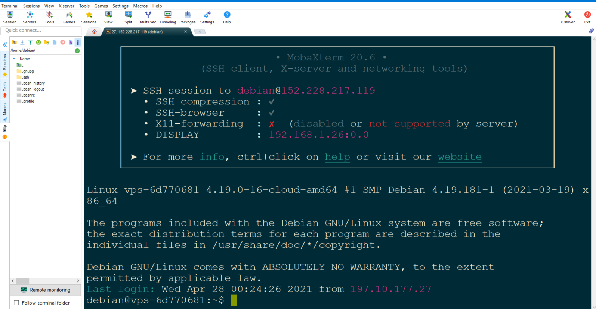

# Mettre en place apache2
Dans ce projet, je vais illustrer l'installation d'apache sur notre serveur **VPS**, 
## INSTALLATION D’APACHE 2
nous en profitons pour installer aussi le langage PHP et le module Apache associé :
<code>
    <pre>
        sudo apt-get install apache2
        sudo apt-get install php
        sudo apt-get install libapache2-mod-php
    </pre>
</code>

Après avoir installé apache2 et PHP, nous allons dans le dossier **var** puis dans le dossier **www** qui va servir de container pour nos site web
<code>
    <pre>
        cd /var/www
    </pre>
</code>
Attribuez à cet utilisateur les droits sur le dossier **/var/www** 
<code>
    <pre>
    sudo chown -R www-data:www-data /var/www
    </pre>
</code>
Pour vérifier le statut de notre serveur, lançons la commande suivante :
<code>
    <pre>
        sudo service apache2 status 
            oubien
        sudo systemctl status apache2
    </pre>
</code>
Résultat: 

qui montre que apache2 est installé et est lancé également, après cela nous pouvons vérifier notre **adress ip** dans le navigateur
<code>
    <pre>
     http://152.228.217.119/
     </pre>
</code>
Aperçu:  

Nous voyons ici que notre serveur Apache2 est bien démarré et, par défaut, il se relancera automatiquement à chaque démarrage de notre VPS.

Pour avoir la doc, il faut l'installer l'utilitaire:
<code>
    <pre>
        sudo apt-get install apache2-doc
    </pre>
</code>
## Quelques commandes utiles
* Pour vérifier la version de votre serveur Web, tapez : 
<code>
    <pre>
       sudo apache2ctl -v
    </pre>
</code> 

* Pour obtenir un statut détaillé du serveur  : 
  <code>
    <pre>
        sudo apachectl status
    </pre>
 </code>

 * Pour arrêter, lancer ou relancer votre serveur: 
    <code>
    <pre>
        sudo service apache2 stop
        sudo service apache2 start
        sudo systemctl reload apache2
    </pre>
 </code>
   
* Pour vérifier les modules chargés d’Apache2 : 
 <code>
    <pre>
        sudo apache2ctl -M
    </pre>
 </code>

 
 * Enfin si nous ne souhaitons pas redémarrer Apache2 au démarrage de votre VPS : 
  <code>
    <pre>
        sudo systemctl disable apache2
    </pre>
 </code>
 * A l’inverse pour réactiver le service : 
  <code>
    <pre>
        sudo systemctl enable apache2
    </pre>
 </code>

 ## LA CONFIGURATION
Les fichiers de configuration de notre serveur se situent dans le répertoire  **/etc/apache2**:

<code>
    <pre>
        /etc/apache2/
            |-- mods-enabled
            |-- conf-enabled
            |-- sites-enabled
    </pre>
 </code>

* Trois dossiers sont disponibles:
  1. **mods-enabled** : pour les fichiers de configuration des **modules** d’Apache 
  2. **conf-enabled** : pour fichiers de configuration des **services** disponibles
  3. **sites-enabled** : pour les fichiers de configuration des **sites** disponibles
   
>**Note** : ces répertoires sont en fait des liens symboliques vers ->les répertoires physiques  **mods-available**, **conf-available** >et **sites-available**.

Il y aura au minimum autant de fichiers de configuration dans **sites-enabled** que de sites proposés.

* Au départ il y a un seul site avec les fichiers suivants : 

        <code>
            <pre>
                /etc/apache2/ 
                    |-- sites-enabled
                        |-- 000-default.conf
                        |-- default-ssl.conf
            </pre>
        </code>

  1. **000-default.conf** : configuration utilisée par le mode HTTP (port 80)
  2. **default-ssl.conf** : configuration utilisée par le mode HTTPS (port 443)

* Le contenu de la configuration HTTP est la suivante :

    <code>
    <pre>
        &lt;VirtualHost *:80&gt;
                ServerAdmin webmaster@localhost
                DocumentRoot /var/www/html
                ErrorLog ${APACHE_LOG_DIR}/error.log
                CustomLog ${APACHE_LOG_DIR}/access.log combined
        &lt;/VirtualHost&gt;
    </pre>
    </code>

    1. La balise <code>VirtualHost</code> permet de définir un hôte virtuel qui écoutera sur le port **80 (HTTP)**.

    2. <code>DocumentRoot</code> indique le chemin des pages web qui seront accessibles sur le serveur : **/var/www/html**

* Apache recommande de créer un fichier de configuration pour chaque hôte virtuel ou application web dans le répertoire **/etc/apache2/sites-available/** 
* correspondant à **«000-default.conf»** via les commandes, nous pouvons l'activer et le desactiver **a2ensite (enable site)** et **a2dissite (disable site)**: 
        <code>
            <pre>
                sudo a2ensite 000-default
                sudo a2dissite 000-default
            </pre>
        </code>
 * De même nous pouvons **activer / désactiver** la configuration correspondant par exemple à  **charset.conf** en tapant : 
        <code>
            <pre>
                sudo a2enconf charset
                sudo a2disconf charset
            </pre>
        </code>

 * Et enfin, nous pouvons **activer / désactiver** le module correspondant par exemple à  **alias.load**
        <code>
            <pre>
                sudo a2enmod alias
                sudo a2dismod alias
            </pre>
        </code>

 * Chaque modification nécessitera une prise en compte des changements via la commande suivante : 
        <code>
            <pre>
                sudo systemctl reload apache2
            </pre>
        </code>
Notons enfin les deux fichiers de configuration ci-dessous : 
        <code>
            <pre>
                /etc/apache2/ 
                    |-- apache2.conf
                    |-- ports.conf
            </pre>
        </code>
   1. **apache2.conf** : configuration générale du serveur (timeout du serveur, utilisateur www-data, niveau de log, …)
   2. **ports.conf** : configuration de la liste des ports en écoute (80 et 443 par défaut)
   
## MODULE PHP
Par défaut ubuntu 18.04 TLS propose PHP 7.2.24 qui est une version assez ancienne. Voici comment faire pour avoir une version récente (la 7.4).
* Pour vérifier la version 
    <code>
           php -v
    </code>

* Enfin installons les modules pour **Apache / MariaDB :**
   <code>
    <pre>
            sudo apt install -y apache2 libapache2-mod-php
            sudo apt install -y php7.4-mysql    
    </pre>
    </code>
* Vérifions que le module PHP est bien activé :
  <code>
    <pre>
           sudo apache2ctl -M | grep php 
    </pre>
    </code>
* Relançons notre serveur Apache pour prendre en compte ces modifications
  <code>
    <pre>
          sudo systemctl restart apache2
    </pre>
    </code>
* Nous pouvons vérifier par une simple page PHP, les informations relatives à votre serveur.

    Editez la page PHP suivante :
    <code>
    <pre>
          cd /var/www/html/
          sudo vi getinfo.php
    </pre>
    </code>

  * Et indiquez la commande :
  <code>
    <pre>
        &lt;?php phpinfo(); ?&gt;
    </pre>
    </code>
 * Vérifier avec http://152.228.217.119/getinfo.php

## Configuration de nom de domaine
Je vais d'abord dans notre serveur **OVH** dans la section **Zone DNS**

puis je clique sur le bouton **Ajouter une entrée**, je choisie champs de pointage <code>**A**</code> pour pouvoir ajouter l'adresse **IP4** de notre **VPS** dans sous-domaine je sais **www**

Et en je confirme 
 
après cette étape, nous pouvons voir que notre site **stardevcgroup.com** pointe maintenant vers **152.228.217.119** pour vérifier il nous sufit de tester ces deux urls suivante
* http://152.228.217.119
* http://stardevcgroup.com 
nous constatons directement que ces deux urls affiche le même résultat au navigateur

## Création d'un hôte virtuel
Pour cela nous allons maintenant acceder à notre **VPS** en **SSH**
dans cet article j'ai choisir l'outil **MobaXterm** qui a une version gratuite qui fait notre affaire mais on pouvait choisir **Putty** qui est aussi intéressant.

Pour ajouter session il suffit de cliquer sur **session** il nous sera demandé votre nom **d'hôte** et **username** puis lorsque nous cliquons sur **OK** il nous demande votre **mot de passe** enfin et lors de prochaine connexion nous n'aurons plus besoin de les retaper.

Aperçu de **MobaXterm** une fois logged dans notre **VPS**

Après quelques manup j'obtiens ça qui n'est pas si mal

* On créer le dossier **stardevcgroup.com** qui va héberger les fichier de notre site
  <code>
  <pre>
        cd /var/ww
        mkdir stardevcgroup.com
        cd stardevcgroup.com
        touch index.html
        nano index.html
  </pre>
  </code>

  et puis je vais ajouter **Bienvenue sur Star Dev Cloud Group**

  

  Pour activer notre site vers ce dossier, nous allons dans **/etc/apache2/sites-enabled** et l'interieur de ce dossier on créer un fichier **startdevcgroup.com.conf**
  <code>
  <pre>
        cd /etc/apache2/sites-enable
        nano stardevcgroup.com
  </pre>
  </code>

  
  Dans ce fichier les deux qui sont essentielles sont:
  * <code>**ServerName**</code> qui indique l'URL du site ou le nom de domaine
  * <code>**DocumentRoot**</code> indique le dossier qui héberge notre site ou tout simplement la racine de notre site 
  si vous voulez en savoir plus [Cliquez ici](https://github.com/camara94/AdministrationdunserveurLAMP#pour-la-cr%C3%A9ation-dun-h%C3%B4te-virtuel)

  * Pour activer cette configuration <code>ap